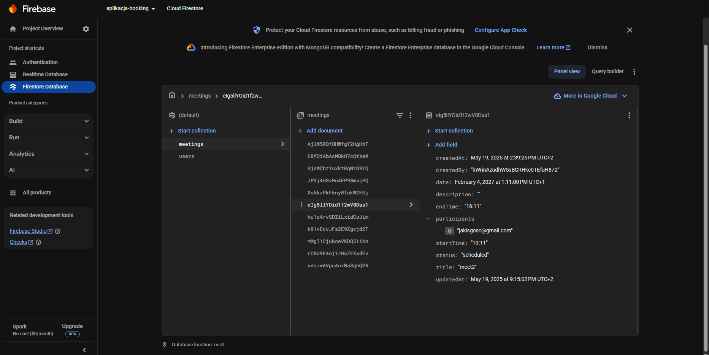

# System Zarządzania Rezerwacjami Spotkań

## Autor

Paulina Pierchała 137817

## Cel Projektu

Celem projektu było stworzenie aplikacji webowej do zarządzania rezerwacjami spotkań, zrealizowanej w technologii React 18+. Aplikacja umożliwia użytkownikom rezerwowanie terminów spotkań, ich edycję i anulowanie. Dostępny jest również panel administratora z rozszerzonymi uprawnieniami do zarządzania wszystkimi rezerwacjami. Projekt został wykonany w ramach zaliczenia przedmiotu [Nazwa Przedmiotu/Kursu - jeśli dotyczy].

## Główne Funkcjonalności

Aplikacja oferuje następujące funkcjonalności:

### Dla Użytkownika Standardowego:
*   **Rejestracja:** Tworzenie nowego konta użytkownika (imię, nazwisko, email, hasło).
*   **Logowanie/Wylogowywanie:** Bezpieczne uwierzytelnianie użytkowników.
*   **Dodawanie Rezerwacji:** Możliwość tworzenia nowych rezerwacji spotkań z określeniem:
    *   Tytułu spotkania
    *   Opisu
    *   Daty
    *   Godziny rozpoczęcia i zakończenia
    *   Listy uczestników (adresy email)
*   **Przeglądanie Własnych Rezerwacji:**
    *   Widok listy rezerwacji (w formie kart) z możliwością filtrowania (po statusie, zakresie dat) i sortowania (po dacie spotkania, dacie utworzenia).
    *   Widok kalendarza (FullCalendar) prezentujący rezerwacje użytkownika.
*   **Edycja Rezerwacji:** Modyfikacja szczegółów istniejących, własnych rezerwacji.
*   **Anulowanie Rezerwacji:** Zmiana statusu własnej rezerwacji na "anulowana".
*   **Interaktywne Powiadomienia:** Komunikaty o sukcesie lub błędzie operacji (Snackbar).

### Dla Administratora:
*   **Dostęp do Panelu Administratora:** Specjalny widok dostępny po zalogowaniu na konto z rolą "admin".
*   **Przeglądanie Wszystkich Rezerwacji:** Dostęp do listy wszystkich rezerwacji w systemie, stworzonych przez dowolnego użytkownika.
*   **Zarządzanie Wszystkimi Rezerwacjami:** Możliwość edycji i anulowania każdej rezerwacji w systemie.
*   (Opcjonalnie, jeśli zaimplementowano) Podstawowe filtrowanie i sortowanie w panelu admina.

## Użyte Technologie

*   **Frontend:**
    *   React 18+ (z wykorzystaniem Hooków)
    *   React Router DOM v6 (routing po stronie klienta)
    *   Material UI (MUI) v5 (biblioteka komponentów UI)
    *   React Hook Form (zarządzanie formularzami i walidacja)
    *   FullCalendar (@fullcalendar/react, @fullcalendar/daygrid, @fullcalendar/timegrid, @fullcalendar/interaction)
    *   Context API (do zarządzania stanem globalnym: `AuthContext`, `SnackbarContext`)
    *   `date-fns` (opcjonalnie, jeśli używane z date pickerami lub do formatowania dat)
*   **Backend (Backend as a Service):**
    *   Firebase Authentication (uwierzytelnianie użytkowników)
    *   Firebase Firestore (baza danych NoSQL)
*   **Narzędzia Deweloperskie:**
    *   Node.js & npm
    *   Git & [GitHub/GitLab/Bitbucket - Twoja platforma] (kontrola wersji)
    *   ESLint (linter kodu)
    *   Create React App (szkielet projektu)

## Struktura Projektu (Główne Foldery w `src/`)

*   `components/`: Zawiera reużywalne komponenty, np. `ProtectedRoute.jsx` do ochrony ścieżek.
*   `contexts/`: Przechowuje konteksty Reacta używane do zarządzania stanem globalnym:
    *   `AuthContext.jsx`: Zarządza stanem uwierzytelnienia użytkownika i jego danymi.
    *   `SnackbarContext.jsx`: Obsługuje globalny system powiadomień.
*   `layouts/`: Komponenty definiujące główną strukturę/układ aplikacji, np. `Navbar.jsx`.
*   `pages/`: Komponenty reprezentujące poszczególne strony/widoki aplikacji, np. `HomePage.jsx`, `LoginPage.jsx`, `MyBookingsPage.jsx`, `AdminDashboardPage.jsx`, `CalendarPage.jsx`, `NewBookingPage.jsx`, `EditBookingPage.jsx`.
*   `firebase.js`: Plik konfiguracyjny i inicjalizacyjny dla Firebase SDK.

## Instalacja i Uruchomienie

Aby uruchomić projekt lokalnie, wykonaj następujące kroki:

1.  **Klonowanie Repozytorium:**
    ```bash
    git clone [https://github.com/liiluus/aplikcaja-booking.git]
    cd [aplikcaja-booking]
    ```

2.  **Instalacja Zależności:**
    Upewnij się, że masz zainstalowany Node.js (zalecana wersja LTS) oraz npm.
    ```bash
    npm install
    ```

3.  **Konfiguracja Firebase:**
    *   Przejdź do [Firebase Console](https://console.firebase.google.com/) i utwórz nowy projekt (lub użyj istniejącego).
    *   W swoim projekcie Firebase włącz następujące usługi:
        *   **Authentication:** W panelu Authentication przejdź do zakładki "Sign-in method" i włącz dostawcę "Email/Password".
        *   **Firestore Database:** Utwórz bazę danych. Na potrzeby deweloperskie możesz zacząć w **trybie testowym**, który pozwala na odczyt/zapis przez 30 dni. Wybierz odpowiedni region serwera.
    *   W ustawieniach projektu Firebase (`Project settings` -> `General`), w sekcji "Your apps", kliknij ikonę `</>` (Web), aby dodać nową aplikację internetową (jeśli jeszcze jej nie masz).
    *   Po zarejestrowaniu aplikacji, skopiuj obiekt konfiguracyjny `firebaseConfig`.
    *   W pliku `src/firebase.js` w sklonowanym projekcie, zastąp placeholder swoimi danymi konfiguracyjnymi:
        ```javascript
        const firebaseConfig = {
          apiKey: "TWOJ_API_KEY",
          authDomain: "TWOJ_AUTH_DOMAIN",
          projectId: "TWOJ_PROJECT_ID",
          storageBucket: "TWOJ_STORAGE_BUCKET",
          messagingSenderId: "TWOJ_MESSAGING_SENDER_ID",
          appId: "TWOJ_APP_ID"
        };
        ```


    *   **Ważne - Indeksy Firestore:** Aplikacja wykorzystuje zapytania do Firestore, które wymagają utworzenia **indeksów złożonych** (szczególnie dla filtrowania i sortowania rezerwacji). Jeśli podczas działania aplikacji (np. na stronie "Moje Rezerwacje" przy zmianie filtrów) w konsoli przeglądarki pojawi się błąd `FirebaseError: The query requires an index...` wraz z linkiem, należy kliknąć ten link. Przeniesie on do konsoli Firebase, gdzie można automatycznie utworzyć wymagany indeks. Tworzenie indeksu może zająć kilka minut. Należy utworzyć wszystkie indeksy, o które poprosi Firebase podczas testowania różnych kombinacji filtrów i sortowania.

4.  **Uruchomienie Aplikacji Deweloperskiej:**
    ```bash
    npm start
    ```
    Aplikacja zostanie uruchomiona i będzie dostępna w przeglądarce pod adresem `http://localhost:3000`.

## Użytkownik Administrator (Konfiguracja)

Aby przetestować funkcjonalności administratora:
1.  Zarejestruj standardowe konto użytkownika poprzez formularz rejestracji w aplikacji.
2.  Przejdź do konsoli Firebase -> Firestore Database -> kolekcja `users`.
3.  Odszukaj dokument nowo zarejestrowanego użytkownika (ID dokumentu to UID użytkownika z sekcji Authentication).
4.  Ręcznie zmień wartość pola `role` w tym dokumencie z `"user"` na `"admin"`.
5.  Po ponownym zalogowaniu na to konto, użytkownik będzie miał uprawnienia administratora (np. dostęp do "/admin-dashboard" i link w Navbarze).

## Dodatkowe Informacje

*   Aplikacja została zaprojektowana z myślą o modularności i czytelności kodu.
*   Interfejs użytkownika jest responsywny i stara się zapewnić dobre doświadczenia użytkownika.

---
## Zdjęcia z okna Firebase





